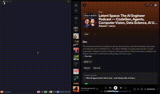

# Spotify Tmux Plugin
Control Spotify directly from your tmux session. Compatible with macOS.


## Features
* Control basic Spotify functions like play, pause, next, and previous.
* Toggle shuffle and repeat modes.
* Add and play Spotify playlists.
* Configure your own keybindings.

## Installation with Tmux Plugin Manager (TPM)
1. Add the plugin to your tmux.conf:
```bash
set -g @plugin 'danjeltahko/spotify-tmux'
```
2. Press prefix + <kbd>I</kbd> to install the plugin.

## Usage
Once installed, you can use the key binding to control Spotify. By default, the key binding is set to prefix + <kbd>S</kbd>.

Press the Spotify prefix followed by the configured keybinding:

| Key | Action                     |
|-----|----------------------------|
| o   | Open Spotify               |
| s   | Toggle shuffle             |
| r   | Toggle repeat              |
| p   | Play/Pause                 |
| l   | Next track                 |
| h   | Previous track             |
| a   | Add a playlist             |
| 1-9 | Play playlists 1 through 9 |

You can customize the key binding by setting the @spotifybinding option in your tmux.conf:

```bash
<<<<<<< HEAD
set -g @spotifyprefix "your_preferred_key"
=======
set -g @spotify-open "o"
set -g @spotify-shuffle "s"
# ... and so on for other commands
>>>>>>> origin/main
```
For example, to change the key binding to prefix + <kbd>Shift</kbd> + <kbd>J</kbd>, you'd add:

```bash
<<<<<<< HEAD
set -g @spotifyprefix "S"
=======
set -g @spotifyprefix "J"
>>>>>>> origin/main
```
## Requirements
* macOS with the Spotify application installed.
* AppleScript support (osascript command available).
