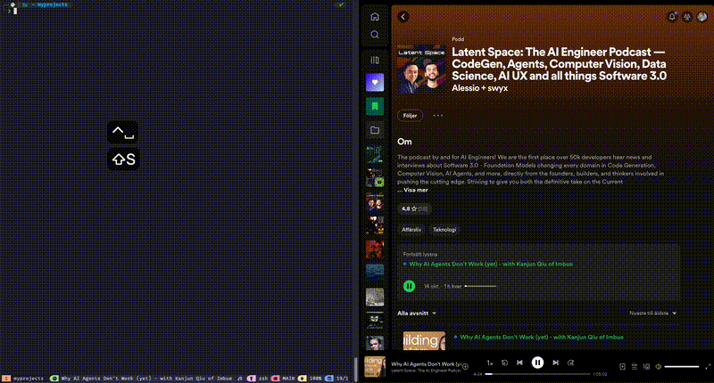

# Spotify Tmux Plugin

Control Spotify directly from your tmux session. Compatible with macOS.



## Features

* Control basic Spotify functions like play, pause, next, and previous.
* Toggle shuffle and repeat modes.
* Bind Spotify playlists/albums/tracks to specific keys (1-9) for quick access.
* Display currently playing track, artist, album, and playback state in the tmux status bar.
* Configure your own keybindings.

## Installation with Tmux Plugin Manager (TPM)

1. Add the plugin to your tmux.conf:
```bash
set -g @plugin 'danjeltahko/spotify-tmux'
```
2. Press prefix + <kbd>I</kbd> to install the plugin.

## Usage

Once installed, you can use the key bindings to control Spotify. By default, the Spotify prefix is set to prefix + <kbd>S</kbd>.

Press the Spotify prefix followed by the configured keybinding:

| Key | Action                     |
|-----|----------------------------|
| o   | Open Spotify               |
| s   | Toggle shuffle             |
| r   | Toggle repeat              |
| p   | Play/Pause                 |
| l   | Next track                 |
| h   | Previous track             |
| a   | Add a playlist             |
| 1-9 | Play playlists 1 through 9 |
| ?   | Show your saved playlists  |

> **Caution: When adding a new playlist/album with <kbd>spotifyprefix+a</kbd>, do not use <kbd>:</kbd> in the naming.** *The playlist file separates the ID, name and Spotify link using <kbd>:</kbd>. So using <kbd>:</kbd> in the name will result in playback issues. Instead, please use <kbd>-</kbd> for example.*

## Configuration

You can customize keybindings and other settings by setting tmux options in your tmux.conf:

```bash
set -g @spotify-open "o"
set -g @spotify-shuffle "s"
set -g @spotify-open "o"
set -g @spotify-shuffle "s"
set -g @spotify-repeat "r"
set -g @spotify-playpause "p"
set -g @spotify-next "l"
set -g @spotify-prev "h"
set -g @spotify-add-playlist "a"
```
For example, to change the key binding to prefix + <kbd>Shift</kbd> + <kbd>J</kbd>, you'd add:

```bash
set -g @spotifyprefix "J"
```

### Status Bar Options

The following options can be interpolated in `status-right` or `status-left`:

- `#{spotify_track}`: Displays the currently playing track.
- `#{spotify_artist}`: Displays the currently playing artist.
- `#{spotify_album}`: Displays the currently playing album.
- `#{spotify_state}`: Displays the Spotify state (shuffle, repeat).

Example:
```bash
set -g status-right "#{spotify_track} | #{spotify_artist} | #{spotify_album} | #{spotify_state}"
```

You can also customize the icons that represent each state by setting tmux options in tmux.conf.
```bash
set -g @spotify-shuffle-icon "†"
set -g @spotify-playing-icon ""
set -g @spotify-repeat-icon "Ω"
```

## Requirements
* macOS with the Spotify application installed.
* AppleScript support (osascript command available).
* In order to have the icons displayed correctly please use / update your favorite [nerd font](https://www.nerdfonts.com/font-downloads).
